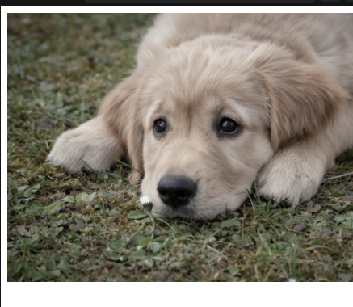

css로 포토샵 같은 효과를 이미지에 줄 수 있음.

The **`filter`** [CSS](https://developer.mozilla.org/en-US/docs/Web/CSS) property applies graphical effects like blur or color shift to an element.

(https://developer.mozilla.org/en-US/docs/Web/CSS/filter).

This is used when applying photoshop like image filters. Mostly used in images, backgrounds, and borders.

`filter : blur(5px);`

`filter : contrast(200%);`

`filter : grayscale(50%)`

`filter : hue-rotate(90deg);`

`filter: drop-shadow(16px 1px 20px red) invert(75%);`

